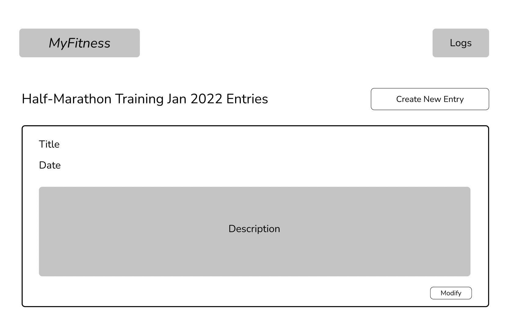

# MyFitness

(Final web app name still to be finalized!)

## Overview

Whether you're a professional athlete or just starting your fitness journey, you're bound to hear about the advantages of keeping a training log. Training logs help you keep track of your progress and allow for self reflection in the future. 

However, it's not easy to keep track of all that information! MyFitness is a web app that will allow users to keep track of their workouts. Once registered and logged in, users can add, remove and update their workouts. They're also able to see all of their past workouts.


## Data Model


The application will store Users, Logs and Entries.

* users have one log (via references)
* each log can have multiple entries (embedded)

An Example User:

```javascript
{
  username: "runneralice",
  hash: // a password hash (which includes the salt),
  log: // a reference to a Log document
}
```

An Example Log with Embedded Entries:

```javascript
{
  user: // a reference to a User object
  name: "Half Marathon Training",
  items: [], // an array of Entry documents
}
```

An Example Entry:
```javascript
{
  title: "5k Training Run",
  date: "03/15/2022",
  description: "Ran a 5k at 6 min per kilometer. Felt..." // String describing workout (essentially workout entry)
}
```


## [Link to Commented First Draft Schema](db.js) 


## Wireframes

/ - home page, welcome users


/register - page for users to register (create an account)


/login - page for users to login to their account


/entries/slug - page for showing all entries


/create - page for creating a new entry


/view/slug - page for viewing an entry


/modify - page for modifying an entry


## Site map


## User Stories or Use Cases

1. As non-registered user, I can register a new account with the site.
2. As a user, I can log in to the site.
3. As a user, I can see all of my entries (title, date and preview) in a single list / table format.
4. As a user, I can create a new entry (title, date, description) in a log.
5. As a user, I can modify an existing entry (including deleting the entry) in a log.
6. As a visitor to the page, I can see the home page to learn more information about the site.


## Research Topics

* (5 points) Passport
    * Passport is "authentication middleware for Node.js"
    * One of their strategies support authentication via username and password, which I'm planning on using
    * Passport offers a more elegant and simpler way for me to handle the user authentication process, which is necessary for implementing user accounts
    * Given my lack of familiarity with Passport, I've assigned it 5 points.
* (4 points) React
    * React is a "front-end JavaScript library for building user interfaces based on UI components"
    * I've used React before in the past, and in my experience, it's helpful in building robust web pages quickly.
    * However, I've never had a back-end with my React apps, which I anticipate being my biggest challenge (Professor Versoza also briefly mentioned that it can be tricky). Hence, I've given it 4 points.
* (2 points) Bootstrap
    * Bootstrap is a "CSS framework directed at responsive, mobile-first front-end web development"
    * Bootstrap makes it easy to quickly integrate CSS into different elements (overall makes it easier to have a nice looking page)
    * Per the requirements, I will be configuring a theme and playing around with other customization
    * Point value assigned based on the requirements
* (3 points) Formik
    * Formik is a library that helps make client-side form validation easier, specifically for React apps
    * For a more integrated and smooth user experience, I'm using Formik for the form validation, especially since my site will consist of quite a few forms.
    * I'm not totally sure if it the errors are integrated into the DOM (following up on that in the next few days with Professor Versoza)
    * Point value assigned based on the requirements

14 points total out of 8 required points


## [Link to Initial Main Project File](app.js) 


## Annotations / References Used

### Tutorials

1. [Passport Password Tutorial](https://www.passportjs.org/tutorials/password/) - (add link to source code that was based on this)
2. [Tutorial on the MERN Stack](https://medium.com/swlh/how-to-create-your-first-mern-mongodb-express-js-react-js-and-node-js-stack-7e8b20463e66) - (add link to source code that was based on this)

### Documentation
1. [Passport Documentation](http://passportjs.org/docs) - (add link to source code that was based on this)
2. [React Documentation](https://reactjs.org/docs/getting-started.html) - (add link to source code that was based on this)
3. [Bootstrap Documentation](https://getbootstrap.com/docs/5.1/getting-started/introduction/) - (add link to source code that was based on this)
4. [Formik Documentation](https://formik.org/docs/overview) - (add link to source code that was based on this)