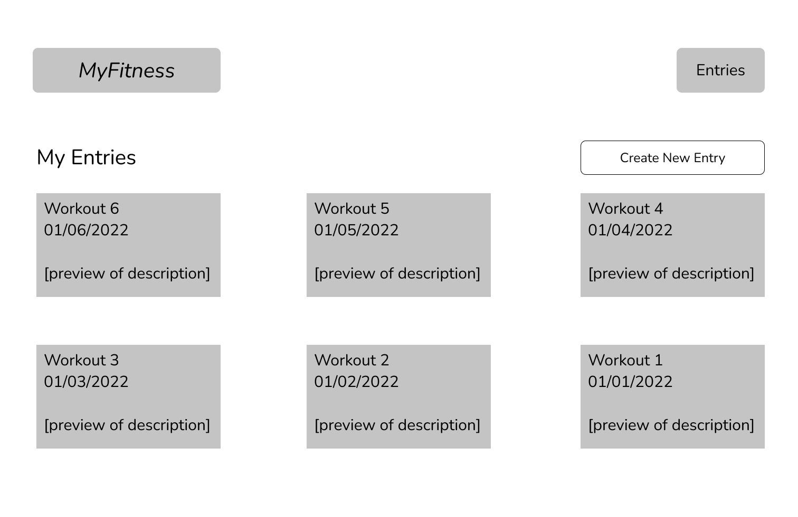
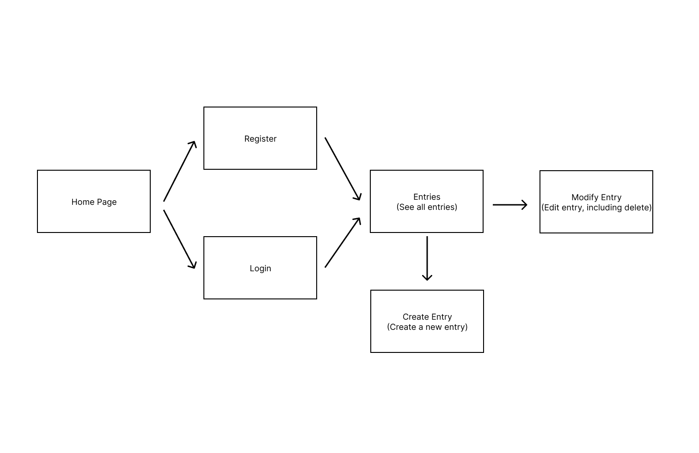

# MyFitness

(Final web app name still to be finalized!)

## Overview

Whether you're a professional athlete or just starting your fitness journey, you're bound to hear about the advantages of keeping a training log. Training logs help you keep track of your progress and allow for self reflection in the future. 

However, it's not easy to keep track of all that information! MyFitness is a web app that will allow users to keep track of their workouts. Once registered and logged in, users can add, remove and update their workouts. They're also able to see all of their past workouts.


## Data Model

The application will store Users, Logs and Entries.

* users have one log (via references)
* each log can have multiple entries (embedded)

An Example User:

```javascript
{
  username: "runneralice",
  hash: // a password hash (which includes the salt),
  log: // a reference to a Log document
}
```

An Example Log with Embedded Entries:

```javascript
{
  user: // a reference to a User object
  name: "Half Marathon Training",
  items: [], // an array of Entry documents
}
```

An Example Entry:
```javascript
{
  title: "5k Training Run",
  date: "03/15/2022",
  description: "Ran a 5k at 6 min per kilometer. Felt..." // String describing workout (essentially workout entry)
}
```


## [Link to Commented First Draft Schema](db.js) 


## Wireframes

/ - home page, welcome users


/register - page for users to register (create an account)


/login - page for users to login to their account


/entries/slug - page for showing all entries


/create - page for creating a new entry


/view/slug - page for viewing an entry


/modify - page for modifying an entry


## Site map




## User Stories or Use Cases

1. As non-registered user, I can register a new account with the site.
2. As a user, I can log in to the site.
3. As a user, I can see all of my entries (title, date and preview) in a single list / table format.
4. As a user, I can create a new entry (title, date, description) in a log.
5. As a user, I can modify an existing entry (including deleting the entry) in a log.
6. As a visitor to the page, I can see the home page to learn more information about the site.


## Research Topics

* (5 points) Integrate user authentication
    * I'm going to be using passport for user authentication
    * An account has been made for testing; I'll email you the password
* (4 points) Perform client side form validation using a JavaScript library
    * see <code>cs.nyu.edu/~jversoza/ait-final/my-form</code>
    * if you put in a number that's greater than 5, an error message will appear in the dom
* (5 points) vue.js
    * used vue.js as the frontend framework; it's a challenging library to learn, so I've assigned it 5 points

10 points total out of 8 required points (___TODO__: addtional points will __not__ count for extra credit_)


## [Link to Initial Main Project File](app.js) 

(__TODO__: create a skeleton Express application with a package.json, app.js, views folder, etc. ... and link to your initial app.js_)

## Annotations / References Used

(__TODO__: list any tutorials/references/etc. that you've based your code off of_)

1. [passport.js authentication docs](http://passportjs.org/docs) - (add link to source code that was based on this)
2. [tutorial on vue.js](https://vuejs.org/v2/guide/) - (add link to source code that was based on this)

