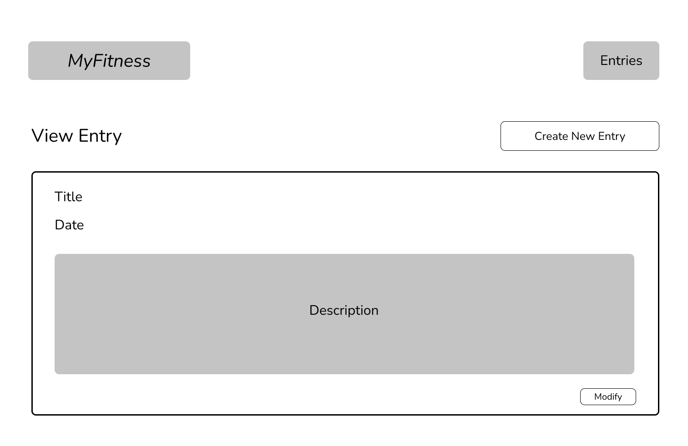

# MyFitness

(Final web app name still to be finalized!)

## Milestone 2 Update

To access the form that isn't login/registration, you do need to be LOGGED IN. (Login credentials have been included in Google form, but they are also here -- username: "test", password: "password")

After logging in, you will be redirected to the page that shows all of your entries (this is the page proves adding an entry works!). You can navigate to the add entry page from the navigation bar at the top of the page. After adding an entry, you will also be redirected to the page showing all of your entries.

Research Topic Updates:
* I have fully integrated Passport into my web app, code is seen [here](./passport_config.js) and [here](./auth.js)
* I have limited bootstrap included (just the navbar for the site)
* I have used a front-end framework, namely React

## Overview

Whether you're a professional athlete or just starting your fitness journey, you're bound to hear about the advantages of keeping a training log. Training logs help you keep track of your progress and allow for self reflection in the future. 

However, it's not easy to keep track of all that information! MyFitness is a web app that will allow users to keep track of their workouts. Once registered and logged in, users can add, remove and update their workouts. They're also able to see all of their past workouts.


## Data Model


The application will store Users, Logs and Entries.

* users have one log (via references)
* each log can have multiple entries (embedded)

An Example User:

```javascript
{
  username: "runneralice",
  hash: // a password hash (which includes the salt),
  log: // a reference to a Log document
}
```

An Example Log with Embedded Entries:

```javascript
{
  user: // a reference to a User object
  name: "Half Marathon Training",
  items: [], // an array of Entry documents
}
```

An Example Entry:
```javascript
{
  title: "5k Training Run",
  date: "03/15/2022",
  description: "Ran a 5k at 6 min per kilometer. Felt..." // String describing workout (essentially workout entry)
}
```


## [Link to Schema](./db.js) 


## Wireframes

/ - home page, welcome users


/register - page for users to register (create an account)


/login - page for users to login to their account


/entries/slug - page for showing all entries


/create - page for creating a new entry


/view/slug - page for viewing an entry


/modify - page for modifying an entry


## Site map


## User Stories or Use Cases

1. As non-registered user, I can register a new account with the site.
2. As a user, I can log in to the site.
3. As a user, I can see all of my entries (title, date and preview) in a single list / table format.
4. As a user, I can create a new entry (title, date, description) in a log.
5. As a user, I can modify an existing entry (including deleting the entry) in a log.
6. As a visitor to the page, I can see the home page to learn more information about the site.


## Research Topics

* (6 points) Passport
    * Passport is "authentication middleware for Node.js"
    * One of their strategies support authentication via username and password, which I'm planning on using
    * Passport offers a more elegant and simpler way for me to handle the user authentication process, which is necessary for implementing user accounts
    * After spending many, many hours trying to integrate Passport into my web app, I've increased its point value.
* (4 points) React
    * React is a "front-end JavaScript library for building user interfaces based on UI components"
    * I've used React before in the past, and in my experience, it's helpful in building robust web pages quickly.
    * However, I've never had a back-end with my React apps, which I anticipate being my biggest challenge (Professor Versoza also briefly mentioned that it can be tricky). Hence, I've given it 4 points.
* (2 points) Bootstrap
    * Bootstrap is a "CSS framework directed at responsive, mobile-first front-end web development"
    * Bootstrap makes it easy to quickly integrate CSS into different elements (overall makes it easier to have a nice looking page)
    * Per the requirements, I will be configuring a theme and playing around with other customization
    * Point value assigned based on the requirements
* (3 points) Formik --- PROBABLY NOT GOING TO DO BUT NOT TOTALLY SURE YET...
    * Formik is a library that helps make client-side form validation easier, specifically for React apps
    * For a more integrated and smooth user experience, I'm using Formik for the form validation, especially since my site will consist of quite a few forms.
    * I'm not totally sure if it the errors are integrated into the DOM (following up on that in the next few days with Professor Versoza)
    * Point value assigned based on the requirements

15 points total out of 8 required points


## Links to Project

### Backend
* [main page for backend](.index.js)
* [page for additional routes](.routes.js)
* [passport local strategy setup](.passport_config.js)
* [login/register routes](.auth.js)

### Frontend
* [main page for frontend](./client/index.js)
* [folder of components](./client/src/components)
* [api for interacting with backend](./client/src/api.js)


## Annotations / References Used

### Notes

### Tutorials

These are links to tutorials that were referenced for specific implementations. Code from these tutorials was referenced and potentially adapted for use in my program.

1. [Passport with MERN Stack Tutorial](https://www.youtube.com/watch?v=IUw_TgRhTBE) - Referenced tutorial to figure out how to integrate Passport within the MERN stack
    1. Passport local strategy set up [here](./passport_config.js)
    2. Implementing login route [here](./auth.js)
2. [Tutorial on the MERN Stack](https://medium.com/swlh/how-to-create-your-first-mern-mongodb-express-js-react-js-and-node-js-stack-7e8b20463e66) - Mainly referenced section 2.1 on integrating BE and FE
    1. Code for api routes [here](./client/src/api.js)
3. [Setting up react-router](https://reactrouter.com/docs/en/v6/getting-started/tutorial) - Mainly referenced to set up [index.js](./client/src/index.js)
4. [Deploying using Heroku and MongoDB Atlas Tutorial with a MERN stack](https://coursework.vschool.io/deploying-mern-app-to-heroku/) - LIFESAVER of a tutorial!!


### Troubleshooting Links

These are links to specific issues I ran into while implementing my web app. These articles/posts helped me resolved bugs and troubleshoot general errors.

1. Issue with req.user information not persisting after logging in (using Passport). Resolved by adding ```{withCredentials: true}``` to the requesets that need the user info AND the login request (most important). Link to code where I added this [here](./client/src/api.js)

### Documentation

These are links to general documentation for different libraries/features used throughout my app. There wasn't specific code based off these. Rather, these docs were mainly used to figure out how specific methods work.

1. [Passport Documentation](http://passportjs.org/docs) -- Being completely honest, this documentation didn't help at all. Very little useful info :(
2. [React Documentation](https://reactjs.org/docs/getting-started.html)
3. [React Router Documentation](https://reactrouter.com/docs/en/v6)
4. [Bootstrap Documentation](https://getbootstrap.com/docs/5.1/getting-started/introduction/)
5. [Formik Documentation](https://formik.org/docs/overview)
6. [Axios Documentation](https://axios-http.com/docs/intro)
7. [Markdown Cheatsheet](https://github.com/tchapi/markdown-cheatsheet/blob/master/README.md) -- referenced to format this README